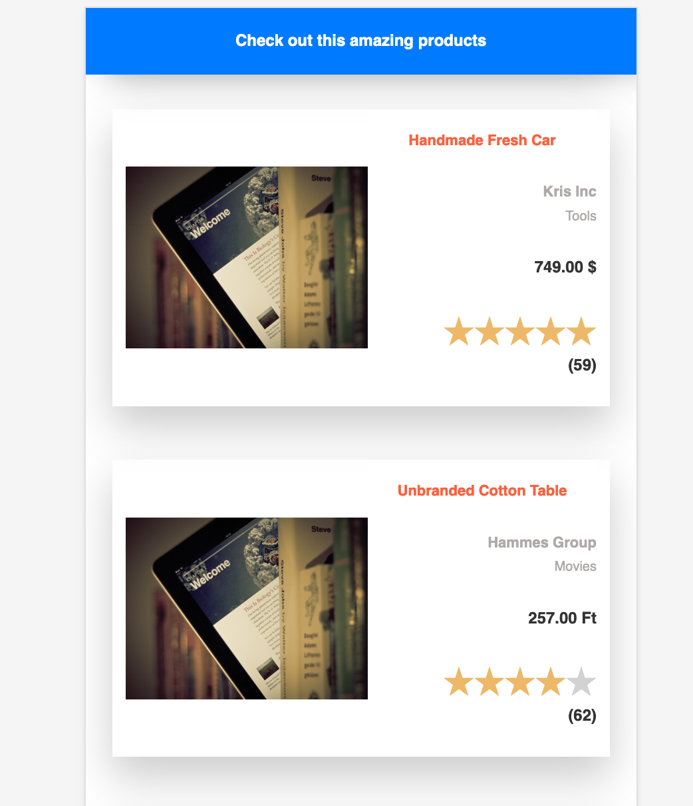

## Responsive Table

Single page, desktop first app build with Angular and CSS with SASS.

### Getting started

This app serves products from [this API](https://github.com/seller-tools/products-api). You need it running locally to be able to use this app fully.

To start the app:

1. Clone this repository

```
$ git clone https://github.com/rafwit/responsive-table
```

2. Navigate to its root folder and run

```
$ npm install
```

and

```
$ ng serve -o
```

### Example screens showing response with screen size change

🔎 768x1024px


🔎 414x736px



**Best 🌍**
